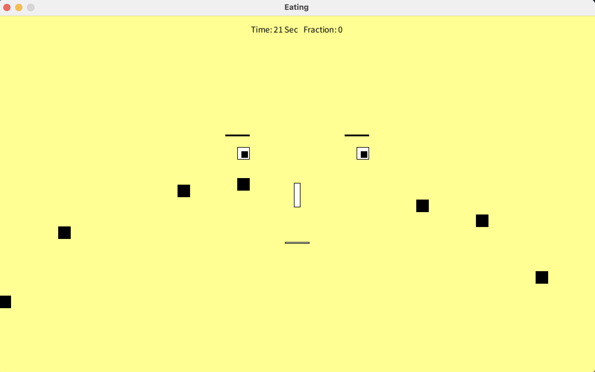

# Eating Game

**作品名稱：** 比賽吃食物
	
**動機：** 本次遊戲的創作，主要來自曾任教過的學生，為了繳交社團作業向我尋求協助，提出遊戲構想構想，希望我教她完成這一份遊戲。在教導過程中，自己預先依照學生想法，將遊戲建置完成，理解其中需要注意的瓶頸，而有助在有效時間下指導學生完成。

**開發環境：** Processing(該IDE以Java為撰寫語言)

**遊戲解說：** 進行遊戲過程，遊戲畫面的右方會跑出黑色方塊的食物，每吃一個便得1分，玩家必須在10分鐘內盡量吃食物。
 

	

 

**操作方式：** 鍵盤按鍵o為人臉向上移動，l為人臉向下移動，w為吃掉食物。
