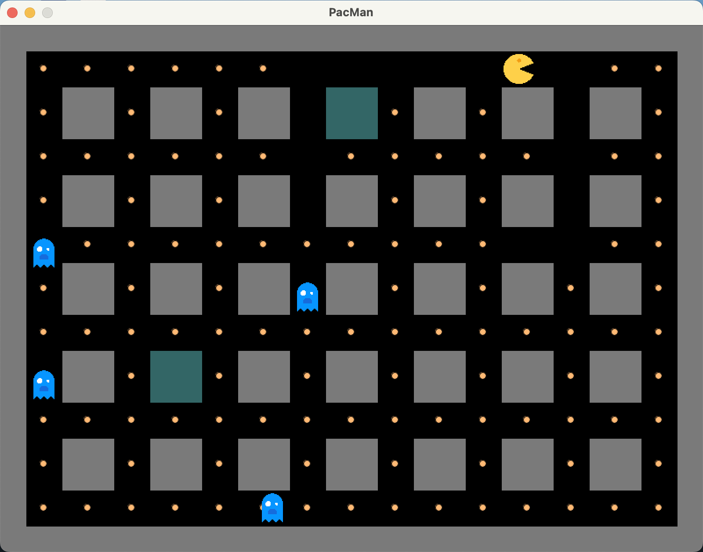

# PacMan

**作品名稱：** 小精靈
	
**動機：** 本次遊戲的製作，主要懷念過往遊戲機的小遊戲，興起模仿該遊戲方式所撰寫。

**開發環境：** Processing(該IDE以Java為撰寫語言)

**遊戲解說：** 遊戲過程中，必須不被鬼給碰觸到，否則將會結束遊戲。而過關的條件，便是將畫面中的所有黃色星星都吃完。

 

	

 

**操作方式：** 鍵盤按鍵w為小精靈向上移動，s為小精靈向下移動，a為小精靈向左移動，d為小精靈向右移動。

**圖片來源：**
下載於www.flaticon.com上，由Freepik製作的icon，作者分別如下：(Icon made by Freepik from www.flaticon.com)
1. 小精靈(pacman_t.png、pacman_b.png、pacman_r.png、pacman_l.png)：<a href="https://www.flaticon.com/free-icons/pacman" title="pacman icons">Pacman icons created by Tahsin Tahil - Flaticon</a>
2. 鬼(halloween.png)：<a href="https://www.flaticon.com/free-icons/casper" title="casper icons">Casper icons created by Sergei Kokota - Flaticon</a>
