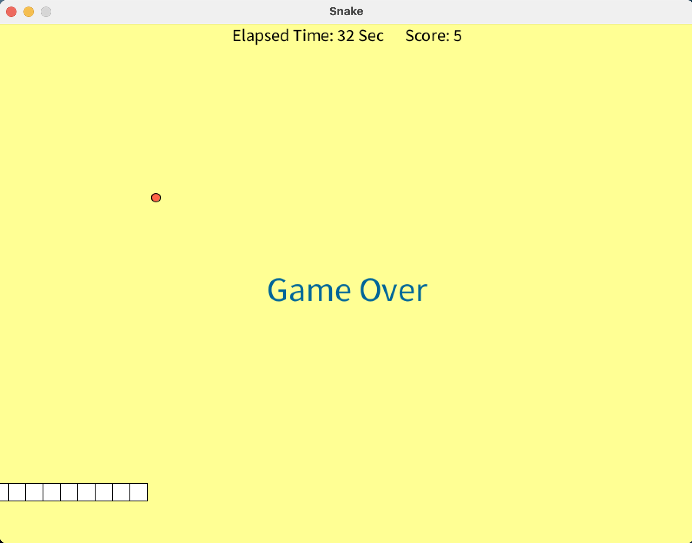

# Snake

**作品名稱：** 貪食蛇
	
**動機：** 本次遊戲的製作，主要懷念Nokia過去的經典手機遊戲貪食蛇，興起模仿該遊戲方式所撰寫。

**開發環境：** Processing(該IDE以Java為撰寫語言)

**遊戲解說：** 進行遊戲過程，遊戲畫面會出現一條會每秒前進一格的小蛇與一個食物，每吃下一個食物便得1分，但小蛇身體也會變長一格。遊戲玩家必須在蛇頭不撞到身體與遊戲畫面邊界進行，若發生以上任一情況，便會結束。
 

	

 

**操作方式：** 鍵盤按鍵w為蛇頭向上移動，s為蛇頭向下移動，a為蛇頭向左移動，d為蛇頭向右移動。
