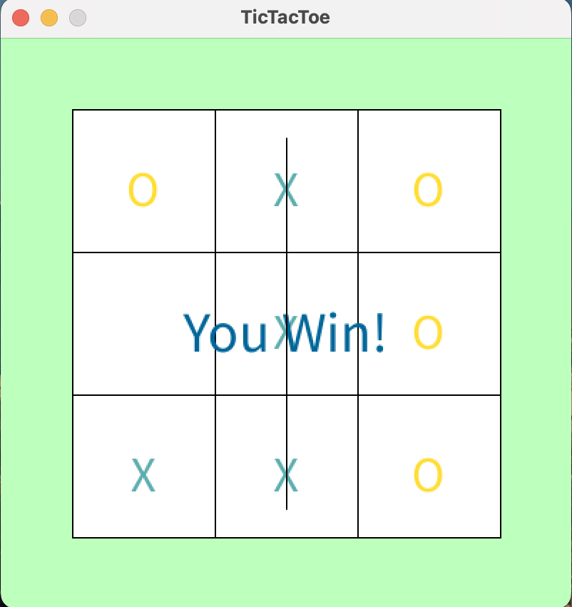

# Tic Tac Toe

**作品名稱：** 井字遊戲
	
**動機：** 此作品動念於想練習MinMax演算法，而興起該遊戲製作。

**開發環境：** Processing(該IDE以Java為撰寫語言)

**遊戲解說：** 進行遊戲過程，遊戲畫面會出現3X3的格子，遊戲玩家為先手，選擇按下一其中個格子。緊接，電腦便會根據MinMax演算法，計算最好的回應。直到雙方有一人勝出或和局，才結束遊戲。

 

	

 

**操作方式：** 遊戲操作方式，是透過滑鼠來進行，對要下的位置，按滑鼠左鍵即可。
